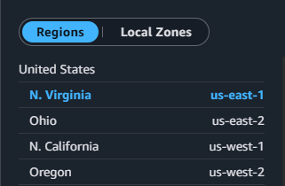

**Exercise Preface: Transitioning from IAM User to Assumed Role**
Upon initial inspection using `aws sts get-caller-identity`, I found that my session was authenticated directly as an IAM User rather than an assumed role. To fully satisfy the objectives of this exercise, I manually created a new IAM role (`ExerciseTestRole`). I attached a **trust policy** allowing my specific IAM user to assume the role, and a **permission policy** granting it read access to S3. I then used the `aws sts assume-role` command to assume this role and generate the temporary credentials used for the remainder of this validation.

---

**1. Identity Command Output:**
```json
{
    "UserId": "AIDAXXXXXXXXXXXXXXXXX:MyExerciseSession",
    "Account": "59******23",
    "Arn": "arn:aws:sts::59******23:assumed-role/ExerciseTestRole/MyExerciseSession"
}
```

**2. Selected Region:**
My selected Region is `us-east-1`. 



**3. Test Results (`aws s3 ls`):**
The command succeeded but returned no output, which confirms there are currently zero S3 buckets in this account. The command was successfully authorized because the `ExerciseTestRole` has the `AmazonS3ReadOnlyAccess` managed permission policy attached, which explicitly allows the `s3:ListAllMyBuckets` action.

**4. Identity Summary:**
In this session, AWS sees me as the temporary session **MyExerciseSession** in account **59******23** and Region **us-east-1**.

**5. Trust Policy vs. Permission Policy:**
> A **trust policy** determines *who* is allowed to assume an IAM role. In this specific scenario, my trust policy dictated that only my IAM user was authorized to assume the test role. A **permission policy**, on the other hand, dictates *what* that identity is actually allowed to do once the role has been successfully assumed.