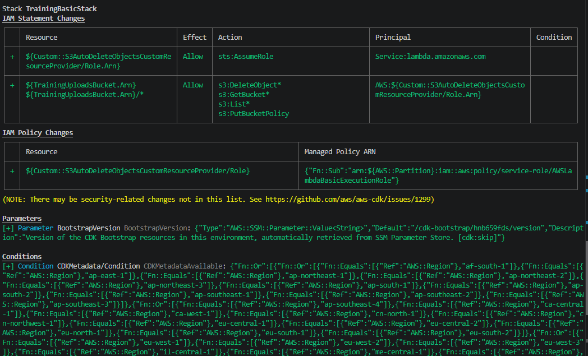
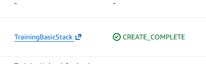
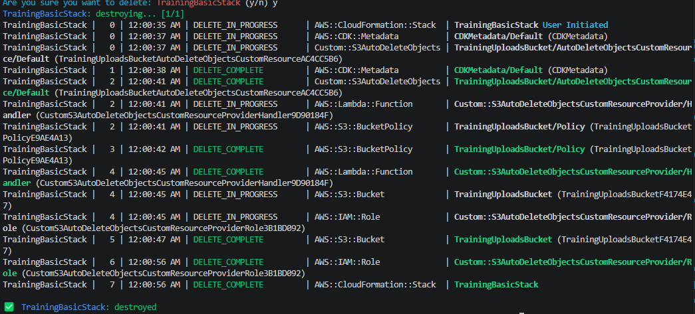
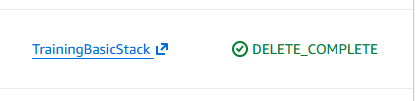

## 1. Stack Preparation & Preview

The following evidence shows the output of the `npx cdk diff` command, previewing the resources (including the S3 bucket) that will be deployed to the AWS environment.



---

## 2. Successful Deployment Validation

After running `npx cdk deploy`, the stack and its resources were successfully created in the AWS cloud. Below is the confirmation from the CloudFormation Events tab.



---

## 3. Safe Change Implementation
For the safe change step, the CDK code was updated to modify the versioning configuration and add a new AWS Tag (`Environment: Lab`) to the existing bucket.

**Modified Code Snippet:**
```typescript
const bucket = new s3.Bucket(this, 'TrainingUploadsBucket', {
  blockPublicAccess: s3.BlockPublicAccess.BLOCK_ALL,
  versioned: false, 
  encryption: s3.BucketEncryption.S3_MANAGED,
  removalPolicy: cdk.RemovalPolicy.DESTROY,
  autoDeleteObjects: true,
});
cdk.Tags.of(bucket).add('Environment', 'Lab');
```

### Logical ID vs Physical ID
The **Logical ID** is the name used in our CDK code, while the **Physical ID** is the unique name AWS automatically assigns to the actual resource when it is deployed to the cloud.

## 4: Cleanup Confirmation
The stack was successfully deleted using `npx cdk destroy` and verified as `DELETE_COMPLETE` in CloudFormation to ensure no ongoing charges.

