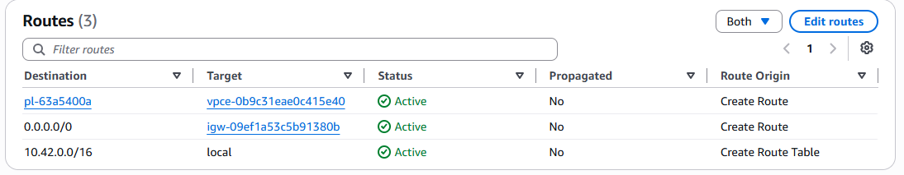
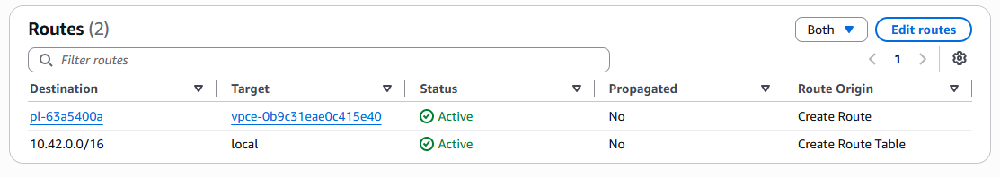
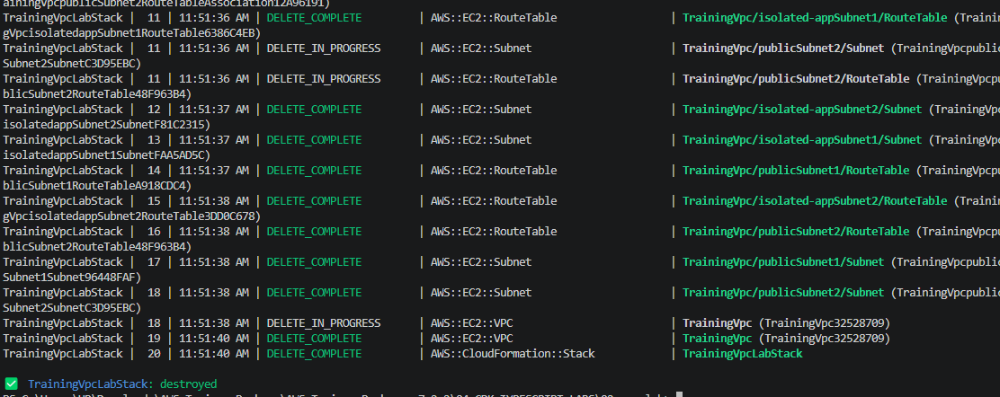

## 1. Infrastructure Details

| Resource | CIDR Block | Availability Zone | Subnet ID |
| :--- | :--- | :--- | :--- |
| **Lab VPC** | `10.42.0.0/16` | N/A | N/A |
| **Public Subnet** | `10.42.1.0/24` | `us-east-1b` (use1-az2) | `subnet-0d0b6a52e0826b01d` |
| **Isolated Subnet** | `10.42.2.0/24` | `us-east-1a` (use1-az1) | `subnet-043d9e04d5406bfce` |

*(Note: Public subnet belongs to `TrainingVpcLabStack/TrainingVpc/publicSubnet2` and Isolated subnet belongs to `TrainingVpcLabStack/TrainingVpc/isolated-appSubnet1`)*

## 2. Route Table

*Public Subnet Route Table (`subnet-0d0b6a52e0826b01d`):*

*(Displays local route `10.42.0.0/16 -> local` and default route `0.0.0.0/0 -> igw-xxxx`)*

*Isolated Subnet Route Table (`subnet-043d9e04d5406bfce`):*

*(Displays local route `10.42.0.0/16 -> local` and S3 endpoint route)*

## 3. Route Explanations

*   **Local Route (`10.42.0.0/16` -> `local`):** This is the default route created with every VPC. It allows all resources within the VPC (across all subnets) to communicate with each other using private IP addresses.
*   **Internet Gateway Route (`0.0.0.0/0` -> `igw-xxxx`):** This route exists only in the public subnet. It directs all traffic destined for the public internet to the Internet Gateway, allowing public-facing resources to communicate outside the VPC.
*   **S3 Endpoint Route:** This route uses an AWS managed Prefix List (which contains all public IP addresses for S3 in the region). Instead of sending S3-bound traffic out to the internet, this route intercepts it and securely routes it over the AWS private network to the S3 service.

## 4. Traffic Scenario Analysis

**Scenario:** *"Can a resource in the isolated subnet call a random public API? Can it reach S3 through the endpoint? Why?"*

*   **Calling a random public API:** **No.** 
    *   *Why:* To reach a public API, the traffic must be routed to `0.0.0.0/0`. The isolated subnet's route table does not have an Internet Gateway attached, nor does it have a NAT Gateway to proxy the traffic. Because there is no valid route for internet-bound traffic, the VPC router will drop those packets.
*   **Reaching S3 through the endpoint:** **Yes.** 
    *   *Why:* Even though S3 is technically a public AWS service, the route table contains a specific route for the S3 Prefix List. Because specific routes take precedence over general routes, when the resource tries to talk to an S3 IP address, the route table directs that traffic to the Gateway VPC Endpoint, successfully bridging the connection privately.

## 5. Cleanup Confirmation

