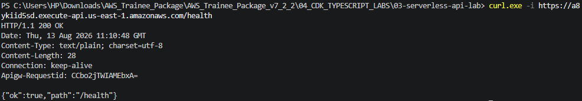
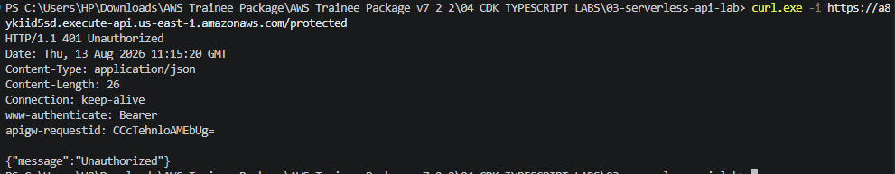
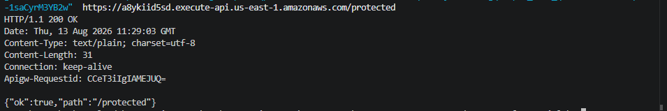
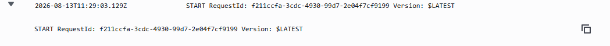

# Lab 03 Evidence: Serverless APIs

## 1. API Invoke URL
https://a8ykiid5sd.execute-api.us-east-1.amazonaws.com/

---

## 2. Public Endpoint Response
**Command executed:**
`curl.exe -i https://a8ykiid5sd.execute-api.us-east-1.amazonaws.com/health`

**Response Evidence:**

---

## 3. Protected Endpoint (No Token) Response
**Command executed:**
`curl.exe -i https://a8ykiid5sd.execute-api.us-east-1.amazonaws.com/protected`

**Response Evidence:**

---

## 4. Protected Endpoint (With Token) Response
**Command executed:**
`curl.exe -i -H "Authorization: Bearer [YOUR_TOKEN]" https://a8ykiid5sd.execute-api.us-east-1.amazonaws.com/protected`

**Response Evidence:**

---

## 5. CloudWatch Log Request ID
**Log Evidence:**
