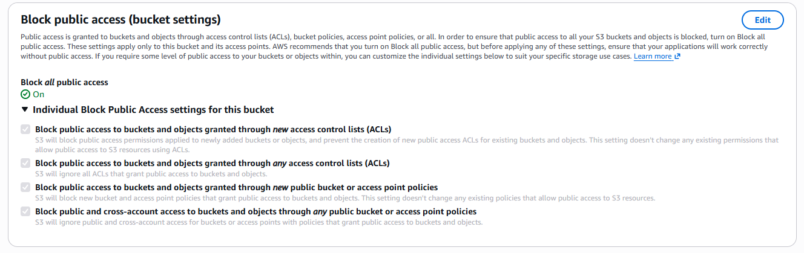
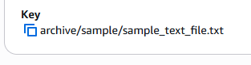
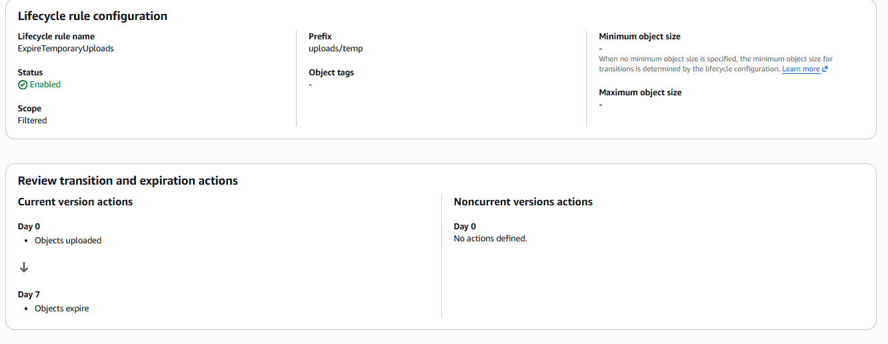

# Lab Evidence: S3 Storage and Content Delivery

## 1. Bucket Public Access Block
**Evidence:** 

## 2. Object Keys and Prefixes
**Evidence:**
* `uploads/tmp/sample_text_file.txt`

* `archive/sample/sample_text_file.txt`

## 3. Lifecycle Rule Configuration
**Rule Name:** ExpireTemporaryUploads
**Filter Prefix:** `uploads/tmp/`
**Action:** Expire current versions of objects after 7 days
**Evidence:** 

## 4. Presigned URL Test
**Redacted URL:** 
`https://lab-private-bucket-kidusdemissie.s3.us-east-1.amazonaws.com/uploads/temp/sample_text_file.txt`
**Result:** The file successfully downloaded using the presigned URL. Attempting to access the direct URL without the query string resulted in an AccessDenied error.

## 5. CloudFront OAC Explanation
Origin Access Control (OAC) allows a completely private S3 bucket to be securely served through CloudFront. When OAC is configured, CloudFront cryptographically signs its requests to S3 using SigV4. You then attach a bucket policy to the S3 bucket that explicitly denies all public access but allows the `s3:GetObject` action *only* if the request originates from the specific CloudFront Distribution ARN. This forces all traffic to flow through CloudFront, ensuring users benefit from caching and TLS encryption without exposing the underlying storage.

## 6. The Danger of Misconfigured Lifecycle Prefix Filters
Lifecycle rules are highly destructive if configured incorrectly. If the prefix filter is accidentally left completely empty, or if a typo is made (e.g., targeting `uploads` instead of `uploads/tmp/`), the expiration rule will silently apply to all objects in the bucket or the wrong directories. This can result in the catastrophic, irreversible deletion of critical production data rather than just the intended temporary files.