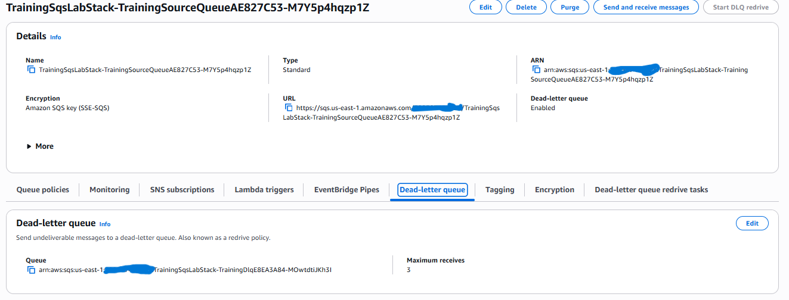
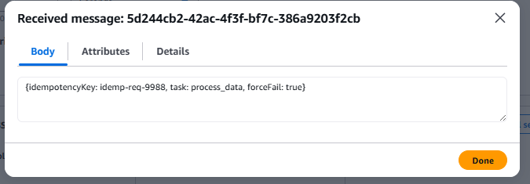

# Lab Evidence: SQS, DLQs, Retries, and Idempotency

## 1. Example message body with idempotencyKey

```bash
aws sqs send-message \
  --queue-url https://sqs.us-east-1.amazonaws.com/<REDACTED_ACCOUNT_ID>/TrainingSqsLabStack-TrainingSourceQueueAE827C53-M7Y5p4hqzp1Z \
  --message-body '{"idempotencyKey": "idemp-req-9988", "task": "process_data", "forceFail": true}'
```

**Message Body:**
```json
{
  "idempotencyKey": "idemp-req-9988",
  "task": "process_data",
  "forceFail": true
}
```

## 2. SQS queue attributes showing DLQ configuration



## 3. CloudWatch log request ID/error line for the failure
Below is the output from the CloudWatch Logs demonstrating the worker's intentional failure to process the message:

```text
START RequestId: 1ef09341-300d-529b-b952-f1bdf8f317df Version: $LATEST

2026-08-17T08:31:09.429Z    1ef09341-300d-529b-b952-f1bdf8f317df    ERROR   Invoke Error    {
    "errorType": "Error",
    "errorMessage": "Intentional training failure to demonstrate DLQ",
    "stack": [
        "Error: Intentional training failure to demonstrate DLQ",
        "    at exports.handler (/var/task/index.js:4:17)",
        "    at Runtime.handleOnceNonStreaming (file:///var/runtime/index.mjs:1306:29)"
    ]
}

END RequestId: 1ef09341-300d-529b-b952-f1bdf8f317df
```

## 4. DLQ message evidence


## 5. Retry and Idempotency Strategy
To safely handle retries without causing duplicate processing, the worker must employ an idempotency strategy. When the worker receives a message, it should first read the `idempotencyKey` and check a persistent, fast-read data store to see if that key already exists and is marked as "Completed". If the key is found and completed, the worker should immediately return a success response to SQS (which deletes the message) without re-executing the business logic. If the key is not found, the worker creates a record locking that key, processes the task, and finally updates the record to "Completed". This ensures that even if SQS delivers the message multiple times due to a network timeout or a partial failure, the actual downstream work is only performed exactly once.