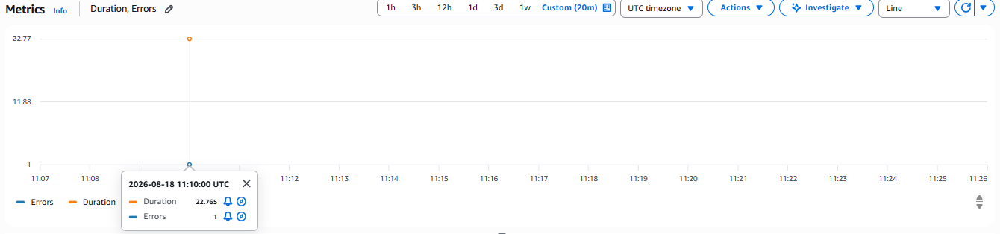
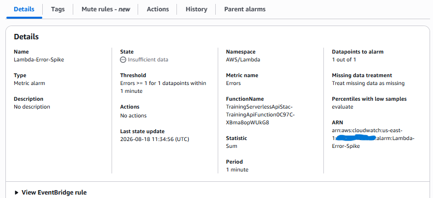

# Lab Evidence: Observability (Logs, Metrics, Alarms, and Traces)

## 1. Failure Request ID and Log Excerpt
**Request ID:** `0d9692ce-144b-41d5-90b8-628cd8f85499`
**Timestamp:** `2026-08-18T11:10:17.425Z`

**Log Excerpt:**
```text
START RequestId: 0d9692ce-144b-41d5-90b8-628cd8f85499 Version: $LATEST
2026-08-18T11:10:17.425Z    0d9692ce-144b-41d5-90b8-628cd8f85499    ERROR   Invoke Error    {
    "errorType": "Error",
    "errorMessage": "Intentional training failure",
    "stack": [
        "Error: Intentional training failure",
        "    at exports.handler (/var/task/index.js:3:46)",
        "    at Runtime.handleOnceNonStreaming (file:///var/runtime/index.mjs:1306:29)"
    ]
}
END RequestId: 0d9692ce-144b-41d5-90b8-628cd8f85499
```

## 2. CloudWatch Metrics (Errors and Duration)



## 3. CloudWatch Alarm Configuration



## 4. X-Ray Trace Evidence
**Trace ID:** `1-6a847787-4ebf768572e60e9a1973ce7c`

**What X-Ray adds beyond logs:** 
While CloudWatch Logs show exactly what broke inside a single function, AWS X-Ray provides a visual service map and distributed tracing. It tracks the request as it crosses service boundaries, showing exactly how long the request spent at each step. This allows for quick identification of latency bottlenecks or errors across multiple microservices that isolated logs alone cannot easily correlate.

## 5. Incident Note
*   **Symptom:** The API/Lambda returned a failure response during a specific invocation.
*   **Evidence:** CloudWatch Metrics recorded a spike of 1 error. CloudWatch Logs for the Lambda function captured an explicit `Invoke Error` tied to Request ID `0d9692ce-144b-41d5-90b8-628cd8f85499`. The X-Ray trace `1-6a847787-4ebf768572e60e9a1973ce7c` confirmed the path of the failed request.
*   **Root Cause:** A controlled exception (`Intentional training failure`) was explicitly thrown by the Lambda handler.
*   **Prevention:** Ensure the active CloudWatch alarm (`Errors >= 1`) is correctly routed to an SNS topic so the operations team is immediately notified if this exception rate occurs again in a production environment.